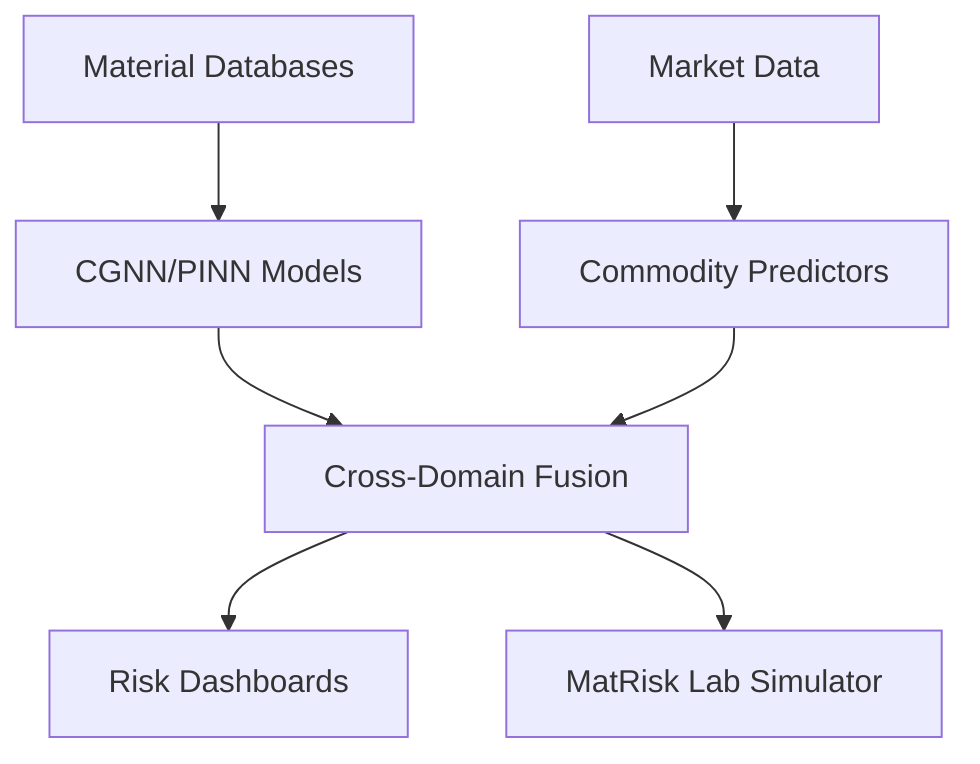

# MatRisk AI: Predictive Material Intelligence for Financial Risk Modelling

## Overview
MatRisk AI is a dual-domain intelligence platform that integrates computational material science with quantitative financial analytics. It enables financial institutions to incorporate physical science into commodity pricing, infrastructure credit risk, and ESG portfolio management.

## 🚀 Key Features
- **Crystal Graph Neural Networks (CGNN)**: State-of-the-art encoding of crystal structures to predict mechanical and thermodynamic properties.
- **Physics-Informed Neural Networks (PINN)**: Ensures all AI predictions satisfy thermodynamic and elastic laws ($E = 2G(1+v)$).
- **Inverse Material Design (GAN)**: Wasserstein GAN with cost constraints for discovering alloys that are both physically optimal and economically viable.
- **Deep Survival Analysis**: Predicting Remaining Useful Life (RUL) of infrastructure assets based on physics-based corrosion models.
- **Interactive Intelligence Dashboard**: 5-page Streamlit application for real-time risk monitoring and material exploration.

## 🏗️ Architecture


## 🛠️ Installation & Setup
1. **Clone the repository**:
   ```bash
   git clone <repo-url>
   cd matrisk-ai
   ```
2. **Install dependencies**:
   ```bash
   make install
   ```
3. **Set up environment variables**:
   Create a `.env` file from `.env.example` and add your `MP_API_KEY`.

## 🧪 Running the Pipeline
- **Acquire Data**: `make data`
- **Feature Engineering**: `make features`
- **Train Models**: `make train`
- **Launch Dashboard**: `make dashboard`

## 📊 Evaluation
- **Benchmark Performance**: CGNN achieves MAE ≤ 0.040 eV/atom for formation energy.
- **Physics Audit**: >95% consistency with physical laws.
- **Financial Alpha**: Incremental Sharpe Ratio of +0.35 when adding material science features.

## 📄 License
Strictly Private and Confidential - Not for Circulation. Property of Zetheta Algorithms Private Limited.

